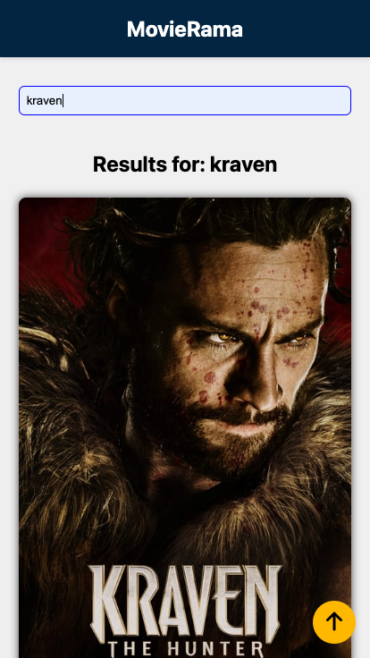

> 🎬 **CineMagic** is a personal project designed to demonstrate frontend development best practices using The Movie Database (TMDb) API. It covers a wide range of frontend features such as lazy loading, infinite scroll, modals, search, and responsive design, with TypeScript and Vite.

# CineMagic App 🎥

## 1 Description

CineMagic is a TypeScript-based frontend web application for browsing and searching movies. Users can view movies currently playing in theaters, search for titles, and explore reviews and similar movies.

### Features

- **Browse Movies in Theaters**: View movies currently playing in theaters with details like poster, title, release year, genres, and rating.
- **Infinite Scrolling**: Seamlessly load more movies as you scroll down.
- **Search Functionality**: Search for movies by typing into a search bar, with debounce to optimize API calls.
- **Movie Details Modal**: Click on a movie to view detailed information, including trailers, reviews, and similar movies.
- **Lazy-Loaded Images**: Improve performance by loading images only when they appear in the viewport.
- **Responsive Design**: Optimized for mobile-first usage, with partial support for tablets and desktops.

### Screenshots

<div style="display: flex; justify-content: space-around; align-items: center; gap: 20px;">

  <div style="text-align: center;">
    
    <p>Home Page</p>
  </div>

  <div style="text-align: center;">
    
    <p>Search Results</p>
  </div>

  <div style="text-align: center;">
    
    <p>Movie Details Modal</p>
  </div>

</div>

### How It Works

1. **Initial Data Fetch**: On the first render, the app fetches movies currently playing in theaters using the TMDb API.
2. **Infinite Scrolling**: An Intersection Observer detects when the user scrolls near the bottom, triggering additional API calls to fetch more movies.
3. **Search Functionality**: As the user types in the search bar, a debounce function delays API calls to optimize performance and fetch movies matching the search query.
4. **Modal for Details**: Clicking on a movie card opens a modal with more information, including a trailer, reviews, and similar movies.
5. **Lazy Loading**: Images are loaded dynamically as they appear in the viewport, improving performance and user experience.

### Technology Stack

- **Frontend**: TypeScript, SCSS, Vite
- **API**: The Movie Database (TMDb) API
- **Testing**: Vitest, Testing Library, Cypress
- **Build Tool**: Vite
- **Containerization**: Docker
- **Deployment**: Nginx, GitHub Actions

---

## 2 Installation

#### Set Up and Run Locally

- A file called .env will be needed. This has to be placed in the root folder of the project and should contain the api-key that is used for all the API calls. This key should be placed in the form of VITE_TMDB_API_KEY=XXXXXX where XXXXXX the key provided by https://www.themoviedb.org/

##### Prerequisites:

- Git
- Node.js version 20.10.0
- npm or yarn

Run these commands to install and run the app locally (quick and easy):

```bash
# Clone the repository (this command needs you to have set up SSH keys in GitHub)
git clone git@github.com:Alexandros00/cinemagic-tmdb-js-ts.git

# Move into the project's folder
cd cinemagic-tmdb-js-ts

# Install dependencies
npm install

# Start the development server
npm run dev
```

#### Set Up and Run Locally Using Docker

##### Prerequisites:

- Git
- Docker version 27.4.0

Running the following command, docker engine will:

1. Build a Docker image containing the app.
2. Create and run a container based on the image.
3. Serve the app via an Nginx server.
   **Caution**: This command will create the docker image **only the first time** that will run! If the code changes, this command will use the image that already exist. In this case the image has to be deleted or re-created using different command.

```bash
docker compose up -d
```

#### Work with this app

##### Prerequisites:

- Git
- Node.js version 20.10.0
- npm or yarn
- Vite\*
- Docker version 27.4.0 (optional)

If you want to contribute to this app, develop more on this app, or customize it, you can fork this repository.

_Vite is a blazing fast frontend build tool powering the next generation of web applications._ (Source: https://vite.dev, accessed on Jan, 2025)

Vite:
• Reduces development server startup time compared to older tools like Webpack.
• Optimized for modern JavaScript and frontend frameworks.
• Simple configuration with support for plugins and customizations.
• Supports VanillaJS, React, Vue, and more with support for TypeScript

### Testing Strategy

The app should be tested using the following approaches:

1. **Unit Tests**: Test individual functions and components for expected behavior.
2. **Integration Tests**: Ensure components work together correctly, focusing on key user flows.
3. **End-to-End (E2E) Tests**: Simulate real user interactions with the app using Cypress.

To run tests:

```bash
# Run unit and integration tests
npm run test

# Open Cypress UI for E2E tests
npm run cypress:open

# Run Cypress E2E tests in the terminal
npm run cypress:run
```

---

## 3 Implementation

### Part I

Mobile-first approach.
When the user visits the page will see a list of cards, each card representing a movie. Due to the mobile-first design, this list has to be vertical and include the aforementioned information (poster, title etc.). I implemented it using a css grid for proper positioning of the cards and the fixed gap between them. Since these movies are the ones that are playing now in theaters, the respective endpoint used to fetch the data.

### Part II

The app is designed to make an API call when the user first visits the page (on initial render) to fetch the first set of movies. When the user scrolls near the bottom of the movie card list, another API call is triggered to fetch more movies. This process continues until all movies are loaded. The endpoint, returns 20 movies per call by default.
To achieve this, I used the Intersection Observer API(https://developer.mozilla.org/en-US/docs/Web/API/Intersection_Observer_API). This API enables the execution of a callback function when a specific element (a sentinel) enters, exits, or changes its intersection with another element or the viewport, based on defined thresholds.
In this implementation, I set a callback function to fetch additional movies (20 per call) whenever the sentinel element at the bottom of the container intersects with the viewport. By setting the root option to null, the intersection is established between the sentinel and the viewport itself. As the user scrolls and the sentinel enters the viewport, the callback function is executed, fetching more movies dynamically.

Since we want good performance, I utilized another Intersection Observer in order to load the poster (image) of every movie card when it starts to appear in the viewport. In this way I implemented lazy-loading for card images in order to:

- Avoid downloading all images immediately when the page loads, something that will increase the page's load time significantly, since we have a lot of images.
- The browser will render faster without delays for download more images than (currently) needed.
- Less bandwidth usage, especially for a mobile-first design (costs and possibly slower network in some cases)
- Additionally, for a mobile-first design, with lazy-loading less computational resources will be needed.
- Better UX! The page loads faster and then images appear while scrolling, giving a smoother experience.
- In general, better performance.

### Part III

There should be an input element for user input, since that app has few functionalities, i decided to put it in the same screen (landing-page). So, above the movies card list, I placed an input element and when the user types something it calls dynamically the endpoint (a different one) for fetching movies from the whole set of movies by providing a search query. i
In order to avoid making calls at every stroke, because for a few characters it may have no meaning and in general it would make the app heavier (n letter word = n API calls), I implemented and applied a debounce function with a small delay that will make the call after a given time (1s in this case) passes after the user's last input character. (1s may be a lot for a production app, but in this case it will demonstrate the functionality).
If the user delete the input, it will call again the first endpoint and will fetch and display movies that are plying now.
In both cases, the user will know when is being displayed, by a header that changes dynamically between <u>In theaters this week</u> and <u>Results for:<user_input></u>. Finally, infinite scroll applies in both cases.

### Part IV

My first thought was that, when the user clicks on a movie card, the card should expand (with a bit delay) in height (due to mobile view) and display the extra information. But, since the images are too long (aspect 3:2) and in order to be visualized properly (in my opinion), they could not be small or cropped (eg. using object-fit: cover). So, after some thought, I decided to create a modal that will appear when clicking the card that will show extra information, without getting user out of context, the scrollable cards will remain as they are and the modal will appear with a smooth animation, and will close by clicking on it (or in the background) again by smoothly fading-out.
Also, I tried fetching images of other sizes too, by modifying the endpoint based on their website's instructions but the aspect ration was the same.
The modal-component consists of two elements, the overlay (probably not the right naming) and the modal itself. The modal SHows on top the title of the movie, and then the trailer (the one video from the list that has type="trailer"). The video is implemented with iframe and some security configurations applied.
Below these there are two reviews, if there is none, there will be a text "No reviews", or in some it my be one only, so one will be displayed.
Each review is in a card structure, with the image of the author (if there is no image, an icon with a figure will be displayed), the author's nickname, as well as the date of the last update of the review and an html meter side by side with the number of the rating. Underneath, there is the text of the review occupying almost three lines max and then is cut, followed by three dots and an anchor with the text "read the full review" that when clicked will open a new tab going to the page of the review.
Lastly, there is a css grid containing cards with similar movies in horizontal orientation, scrollable in order to fit them all. I din't put a limit there. Each of those cards has te title, the poster, the rating and the year.
The opening animation is functional but will benefit from further polish in future updates.

### Part V

I installed and set up, vitest, testing-library and cypress in order to create unit tests for functions and for components as well as integration and e2e tests. Initial tests were written to validate core functionality. Additional tests are planned. My strategy on this would be to:

- Test every function as a unit and while doing it also apply error handlers for every possible case and refactor if and where is needed. In future iterations, I plan to follow a test-driven development approach, so to implement the tests based on what the function needs to do and then implement the function to act as this.
- Same for each component, to test that it renders and includes its basic parts eg:some text, image etc.
- Then integration tests to verify that the components communicate as they should, preferably in pairs, two components per test.
- Finally, e2e tests simulating user's interaction in the page

Of course in the above with mocking functions (eg. from external libraries) and API calls when needed.

### General comments and information

- The app is partially responsive for tablet, desktop and large-desktop. Partial responsiveness is implemented. Planned improvements include switching MovieCards to a horizontal layout on desktop for more effective use of space. Fist of all to change the orientation of the MovieCards to horizontal for desktop and large-desktop, and in this way more information could be displayed in a card. Same stands for the modal tat could provide more.
- In each movie card, before the image being displayed a custom loader appears with a smooth animation for better user experience.
- In case an image can't be loaded, a placeholder appears by using onerror attribute of img element.
- As mentioned above, there is configuration for running the app in docker container with an nginx as server for the app.
- Also, I set GitHub Actions and deployed the app on a remote server by pushing committed code. The app is currently deployed via GitHub Actions to a private testing server.

### Improvements

- Testing of course as mentioned above
- Fallback mechanisms in case of corrupted data (eg. if a card throw any kind of error that is not handled inside to show some message without messing the other parts of the app or even the other cards)
- Implement error handling in more places as well as throw errors in more places (in order to catch their exceptions)
- I would improve the structure based on conceptually related elements to be grouped
- To split more functions based on Single Responsibility Principle
- To clean and split the MoviesStore, I know that it is huge and untestable with too much responsibilities inside
- To improve styles in all screen sizes
- To apply an X button on the right side of the input element to clear user's input
- To improve GitHub Actions' deploy yml file
- Also, to configure pre-commit testing with husky library
- Create JSDocs, at least for some parts that needed them
- One thing that I didn't use is accessibility enhancements like some ARIA labels, roles and ariaHidden
- Provide autosuggestions maybe in search (if their API provides it, I haven't checked)
- Also I didn't gave much attention to SEO, didn't have the time to check it, even though I have worked with it for a business website, working with Lighthouse, improve performance, ranking in google search etc.

### Project Structure

```plaintext
src
├── components
│ ├── GoToTopButton
│ │ ├── goToTopButton.scss
│ │ └── goToTopButton.ts
│ ├── MoviesContainer
│ │ ├── MoviesContainer.scss
│ │ ├── MoviesContainer.ts
│ │ ├── infiniteLoadMovies.ts
│ │ └── lazyLoadCardImage.ts
│ ├── common
│ │ ├── Loader
│ │ │ ├── Loader.scss
│ │ │ └── Loader.ts
│ │ ├── createImageElement.ts
│ │ └── customPlaceholder
│ │ ├── CustomPlaceholder.scss
│ │ └── CustomPlaceholder.ts
│ ├── infiniteScrollSentinel
│ │ ├── InfiniteScrollSentinel.scss
│ │ └── InfiniteScrollSentinel.ts
│ ├── movieCard
│ │ ├── MovieCard.scss
│ │ └── MovieCard.ts
│ ├── movieDetails
│ │ ├── MovieDetails.scss
│ │ ├── MovieDetails.ts
│ │ └── helpers
│ │ └── iframeHelpers.ts
│ ├── navbar
│ │ ├── NavBar.scss
│ │ └── NavBar.ts
│ ├── reviewElement
│ │ ├── ReviewElement.scss
│ │ └── ReviewElement.ts
│ ├── reviewsElement
│ │ ├── ReviewsElement.scss
│ │ └── ReviewsElement.ts
│ └── searchInput
│ ├── SearchInput.scss
│ └── SearchInput.ts
├── entities
│ ├── Genre.ts
│ ├── Genres.ts
│ ├── Movie.ts
│ ├── Review.ts
│ ├── SimilarMovies.ts
│ └── Video.ts
├── helpers.ts
├── main.ts
├── pages
│ └── landingPage
│ ├── LandingPage.scss
│ └── LandingPage.ts
├── services
│ ├── Service.ts
│ └── ServiceConfig.ts
├── stores
│ └── MoviesStore.ts
├── style.scss
├── styles
│ └── variables.scss
├── types
│ ├── GetResponseGenres.ts
│ └── GetResponseMovies.ts
└── vite-env.d.ts
```

### Coverage report from v8

| File                                      | % Stmts   | % Branch   | % Funcs   | % Lines   | Uncovered Line #s   |
| ----------------------------------------- | --------- | ---------- | --------- | --------- | ------------------- |
| All files                                 | 2.24      | 58.06      | 54.54     | 2.24      |
| src                                       | 9.43      | 50         | 25        | 9.43      |
| helpers.ts                                | 19.23     | 100        | 33.33     | 19.23     | 2-11,14-24          |
| main.ts                                   | 0         | 0          | 0         | 0         | 1-33                |
| src/components/GoToTopButton              | 0         | 0          | 0         | 0         |
| goToTopButton.ts                          | 0         | 0          | 0         | 0         | 1-23                |
| src/components/MoviesContainer            | 0         | 66.66      | 66.66     | 0         |
| MoviesContainer.ts                        | 0         | 100        | 100       | 0         | 2-43                |
| infiniteLoadMovies.ts                     | 0         | 100        | 100       | 0         | 3-24                |
| lazyLoadCardImage.ts                      | 0         | 0          | 0         | 0         | 1-28                |
| src/components/common                     | 0         | 0          | 0         | 0         |
| createImageElement.ts                     | 0         | 0          | 0         | 0         | 1-20                |
| src/components/common/Loader              | 0         | 0          | 0         | 0         |
| Loader.ts                                 | 0         | 0          | 0         | 0         | 1-10                |
| src/components/common/customPlaceholder   | 0         | 0          | 0         | 0         |
| CustomPlaceholder.ts                      | 0         | 0          | 0         | 0         | 1-15                |
| src/components/infiniteScrollSentinel     | 0         | 0          | 0         | 0         |
| InfiniteScrollSentinel.ts                 | 0         | 0          | 0         | 0         | 1-15                |
| src/components/movieCard                  | 0         | 100        | 100       | 0         |
| MovieCard.ts                              | 0         | 100        | 100       | 0         | 2-162               |
| src/components/movieDetails               | 0         | 100        | 100       | 0         |
| MovieDetails.ts                           | 0         | 100        | 100       | 0         | 3-128               |
| src/components/movieDetails/helpers       | 0         | 100        | 100       | 0         |
| iframeHelpers.ts                          | 0         | 100        | 100       | 0         | 2-44                |
| src/components/navbar                     | 100       | 100        | 100       | 100       |
| NavBar.ts                                 | 100       | 100        | 100       | 100       |
| src/components/reviewElement              | 0         | 100        | 100       | 0         |
| ReviewElement.ts                          | 0         | 100        | 100       | 0         | 2-102               |
| src/components/reviewsElement             | 0         | 100        | 100       | 0         |
| ReviewsElement.ts                         | 0         | 100        | 100       | 0         | 2-58                |
| src/components/searchInput                | 0         | 0          | 0         | 0         |
| SearchInput.ts                            | 0         | 0          | 0         | 0         | 1-29                |
| src/entities                              | 0         | 83.33      | 83.33     | 0         |
| Genre.ts                                  | 0         | 0          | 0         | 0         |
| Genres.ts                                 | 0         | 0          | 0         | 0         | 1-44                |
| Movie.ts                                  | 0         | 0          | 0         | 0         |
| Review.ts                                 | 0         | 0          | 0         | 0         |
| SimilarMovies.ts                          | 0         | 0          | 0         | 0         |
| Video.ts                                  | 0         | 0          | 0         | 0         |
| src/pages/landingPage                     | 0         | 0          | 0         | 0         |
| LandingPage.ts                            | 0         | 0          | 0         | 0         | 1-59                |
| src/services                              | 0         | 0          | 0         | 0         |
| Service.ts                                | 0         | 0          | 0         | 0         | 1-86                |
| ServiceConfig.ts                          | 0         | 0          | 0         | 0         | 1-4                 |
| src/stores                                | 0         | 0          | 0         | 0         |
| MoviesStore.ts                            | 0         | 0          | 0         | 0         | 1-305               |
| src/types                                 | 0         | 0          | 0         | 0         |
| GetResponseGenres.ts                      | 0         | 0          | 0         | 0         |
| GetResponseMovies.ts                      | 0         | 0          | 0         | 0         |
| ----------------------------------------- | --------- | ---------- | --------- | --------- | ------------------- |
